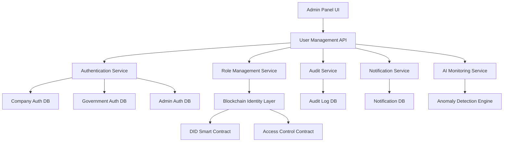

# Design Document - Admin Panel User Management System

## Overview

The Admin Panel User Management System is a comprehensive administrative interface that provides centralized control over all user accounts, roles, and security features across the Blue Carbon Credit Management platform. The system integrates with multiple databases, blockchain identity layers, and AI-powered monitoring to deliver a secure, scalable, and user-friendly administrative experience.

## Architecture

### High-Level Architecture



### System Components

#### 1. Frontend Layer (React Components)
- **AdminUserManagement** - Main container component
- **UserOverviewDashboard** - Statistics and metrics display
- **UserManagementTable** - Interactive user listing with search/filter
- **UserDetailsModal** - Detailed user profile and actions
- **RoleManagementPanel** - Role assignment and permissions
- **SecurityVerificationPanel** - KYC, biometric, and MFA management
- **AuditTrailViewer** - Activity logs and audit history
- **BulkOperationsPanel** - Multi-user management actions

#### 2. Backend Services
- **UserManagementService** - Core user operations and CRUD
- **AuthenticationService** - Multi-database authentication handling
- **RoleManagementService** - Permission and access control
- **AuditService** - Logging and trail management
- **NotificationService** - Email and alert management
- **BlockchainService** - DID and smart contract integration
- **AIMonitoringService** - Anomaly detection and security analysis

#### 3. Database Layer
- **CompanyAuth DB** - Company user credentials and profiles
- **GovAuth DB** - Government user credentials and clearances
- **AdminAuth DB** - Administrator credentials and permissions
- **AuditLog DB** - Comprehensive activity and change logs
- **Notification DB** - Email templates and delivery tracking

#### 4. Blockchain Integration
- **DID Smart Contract** - Decentralized identity management
- **AccessControl Contract** - Role-based permission enforcement
- **AuditTransparency Contract** - Immutable audit logging

## Components and Interfaces

### 1. User Overview Dashboard Component

**Purpose:** Provide real-time statistics and visual metrics for all platform users.

**Interface:**
```typescript
interface UserOverviewProps {
  refreshInterval?: number;
  dateRange?: DateRange;
}

interface UserStats {
  totalUsers: number;
  activeCompanies: number;
  verifiedGovernmentAccounts: number;
  pendingVerifications: number;
  blockedAccounts: number;
  recentLogins: UserLoginInfo[];
}
```

**Features:**
- Real-time metrics with auto-refresh
- Interactive charts using Chart.js/Recharts
- Drill-down capability to filtered user lists
- Export functionality for reports
- Responsive design for mobile access

### 2. User Management Table Component

**Purpose:** Centralized interface for searching, filtering, and managing all user accounts.

**Interface:**
```typescript
interface UserTableProps {
  users: UserAccount[];
  onUserSelect: (user: UserAccount) => void;
  onBulkAction: (action: BulkAction, userIds: string[]) => void;
}

interface UserAccount {
  id: string;
  email: string;
  name: string;
  role: UserRole;
  status: AccountStatus;
  registrationDate: Date;
  lastLogin: Date;
  verificationStatus: VerificationStatus;
  blockchainDID?: string;
}
```

**Features:**
- Advanced search with multiple criteria
- Real-time filtering by role, status, date ranges
- Sortable columns with persistent preferences
- Bulk selection and operations
- Pagination with configurable page sizes
- Export to CSV/PDF functionality

### 3. User Details Modal Component

**Purpose:** Comprehensive view of individual user profiles with management actions.

**Interface:**
```typescript
interface UserDetailsProps {
  user: UserAccount;
  onClose: () => void;
  onUpdate: (updates: UserUpdates) => void;
}

interface UserProfile {
  basicInfo: UserBasicInfo;
  kycDocuments: KYCDocument[];
  blockchainIdentity: BlockchainIdentity;
  activityLog: ActivityLogEntry[];
  securitySettings: SecuritySettings;
  linkedProjects?: ProjectInfo[];
}
```

**Features:**
- Tabbed interface for organized information
- Document viewer for KYC materials
- Blockchain identity verification
- Activity timeline with filtering
- Quick action buttons for common tasks
- Real-time status updates

### 4. Role Management Panel Component

**Purpose:** Control user roles and access permissions across all panels.

**Interface:**
```typescript
interface RoleManagementProps {
  user: UserAccount;
  availableRoles: Role[];
  onRoleChange: (newRole: Role) => void;
}

interface Role {
  id: string;
  name: string;
  permissions: Permission[];
  panelAccess: PanelAccess[];
  requiresVerification: boolean;
}
```

**Features:**
- Visual role hierarchy display
- Permission matrix for clear understanding
- Approval workflow for role elevation
- Blockchain integration for immutable role changes
- Audit trail for all role modifications

### 5. Security Verification Panel Component

**Purpose:** Manage KYC, biometric verification, and multi-factor authentication.

**Interface:**
```typescript
interface SecurityPanelProps {
  user: UserAccount;
  onVerificationUpdate: (type: VerificationType, status: boolean) => void;
}

interface SecuritySettings {
  kycStatus: KYCStatus;
  biometricEnabled: boolean;
  mfaEnabled: boolean;
  emailVerified: boolean;
  phoneVerified: boolean;
  faceVerificationData?: BiometricData;
}
```

**Features:**
- KYC document review and approval interface
- Biometric enrollment for high-security users
- MFA configuration and testing
- Email/SMS verification management
- Security score calculation and display

## Data Models

### User Account Model
```typescript
interface UserAccount {
  // Basic Information
  id: string;
  email: string;
  passwordHash: string;
  role: UserRole;
  status: AccountStatus;
  
  // Profile Data
  name: string;
  organization?: string;
  department?: string;
  officialId?: string;
  
  // Security & Verification
  isVerified: boolean;
  kycStatus: KYCStatus;
  mfaEnabled: boolean;
  biometricEnabled: boolean;
  
  // Blockchain Integration
  blockchainDID?: string;
  walletAddress?: string;
  
  // Audit Fields
  createdAt: Date;
  updatedAt: Date;
  lastLogin?: Date;
  failedAttempts: number;
  lockedUntil?: Date;
}
```

### Activity Log Model
```typescript
interface ActivityLogEntry {
  id: string;
  userId: string;
  action: string;
  resource: string;
  resourceId?: string;
  oldValues?: Record<string, any>;
  newValues?: Record<string, any>;
  ipAddress: string;
  userAgent: string;
  sessionId: string;
  success: boolean;
  errorMessage?: string;
  timestamp: Date;
}
```

### Audit Trail Model
```typescript
interface AuditTrailEntry {
  id: string;
  adminId: string;
  targetUserId: string;
  action: AdminAction;
  details: Record<string, any>;
  justification?: string;
  ipAddress: string;
  timestamp: Date;
  blockchainTxHash?: string;
}
```

## Error Handling

### Error Categories
1. **Authentication Errors** - Invalid credentials, expired sessions
2. **Authorization Errors** - Insufficient permissions, role restrictions
3. **Validation Errors** - Invalid input data, constraint violations
4. **Database Errors** - Connection issues, query failures
5. **Blockchain Errors** - Smart contract failures, network issues
6. **External Service Errors** - Email service, AI monitoring failures

### Error Handling Strategy
```typescript
interface ErrorHandler {
  handleAuthError(error: AuthError): ErrorResponse;
  handleValidationError(error: ValidationError): ErrorResponse;
  handleDatabaseError(error: DatabaseError): ErrorResponse;
  handleBlockchainError(error: BlockchainError): ErrorResponse;
}

interface ErrorResponse {
  code: string;
  message: string;
  details?: Record<string, any>;
  userMessage: string;
  retryable: boolean;
}
```

### Recovery Mechanisms
- **Automatic Retry** - For transient network and service errors
- **Graceful Degradation** - Continue operation with reduced functionality
- **User Notification** - Clear error messages with suggested actions
- **Admin Alerts** - Critical error notifications for system administrators
- **Audit Logging** - All errors logged for analysis and debugging

## Testing Strategy

### Unit Testing
- **Component Testing** - React component behavior and rendering
- **Service Testing** - Business logic and data processing
- **Utility Testing** - Helper functions and validation logic
- **Mock Integration** - External service and database mocking

### Integration Testing
- **API Testing** - Backend service integration
- **Database Testing** - Multi-database transaction handling
- **Blockchain Testing** - Smart contract interaction
- **Authentication Testing** - Multi-panel authentication flows

### End-to-End Testing
- **User Workflows** - Complete admin task scenarios
- **Security Testing** - Permission and access control validation
- **Performance Testing** - Large dataset handling and response times
- **Cross-Browser Testing** - Compatibility across different browsers

### Security Testing
- **Penetration Testing** - Vulnerability assessment
- **Access Control Testing** - Role-based permission validation
- **Data Protection Testing** - PII and sensitive data handling
- **Audit Trail Testing** - Logging completeness and integrity

## Performance Considerations

### Frontend Optimization
- **Lazy Loading** - Component and route-based code splitting
- **Virtual Scrolling** - Efficient large dataset rendering
- **Memoization** - React.memo and useMemo for expensive operations
- **Debounced Search** - Optimized real-time search functionality

### Backend Optimization
- **Database Indexing** - Optimized queries for user searches and filters
- **Caching Strategy** - Redis caching for frequently accessed data
- **Connection Pooling** - Efficient database connection management
- **Async Processing** - Background jobs for heavy operations

### Scalability Design
- **Horizontal Scaling** - Microservice architecture support
- **Load Balancing** - Multiple instance support
- **Database Sharding** - User data distribution strategy
- **CDN Integration** - Static asset delivery optimization

## Security Architecture

### Authentication & Authorization
- **Multi-Database Authentication** - Isolated credential storage
- **JWT Token Management** - Secure session handling
- **Role-Based Access Control** - Granular permission system
- **Session Management** - Secure session lifecycle

### Data Protection
- **Encryption at Rest** - Database encryption for sensitive data
- **Encryption in Transit** - HTTPS and secure API communication
- **PII Protection** - Personal data anonymization and masking
- **Audit Encryption** - Tamper-proof audit log protection

### Blockchain Security
- **Smart Contract Auditing** - Security review of identity contracts
- **Private Key Management** - Secure key storage and rotation
- **Transaction Validation** - Multi-signature requirements for critical operations
- **Immutable Logging** - Blockchain-based audit trail protection

## Deployment Architecture

### Environment Configuration
- **Development** - Local development with mock services
- **Staging** - Production-like environment for testing
- **Production** - High-availability deployment with monitoring

### Infrastructure Requirements
- **Frontend Hosting** - CDN-enabled static site hosting
- **Backend Services** - Containerized microservices deployment
- **Database Cluster** - Multi-master PostgreSQL setup
- **Blockchain Network** - Ethereum/Polygon network integration
- **Monitoring Stack** - Comprehensive logging and alerting

### CI/CD Pipeline
- **Automated Testing** - Full test suite execution
- **Security Scanning** - Vulnerability assessment
- **Database Migration** - Schema update automation
- **Blue-Green Deployment** - Zero-downtime deployments
- **Rollback Strategy** - Quick recovery from deployment issues